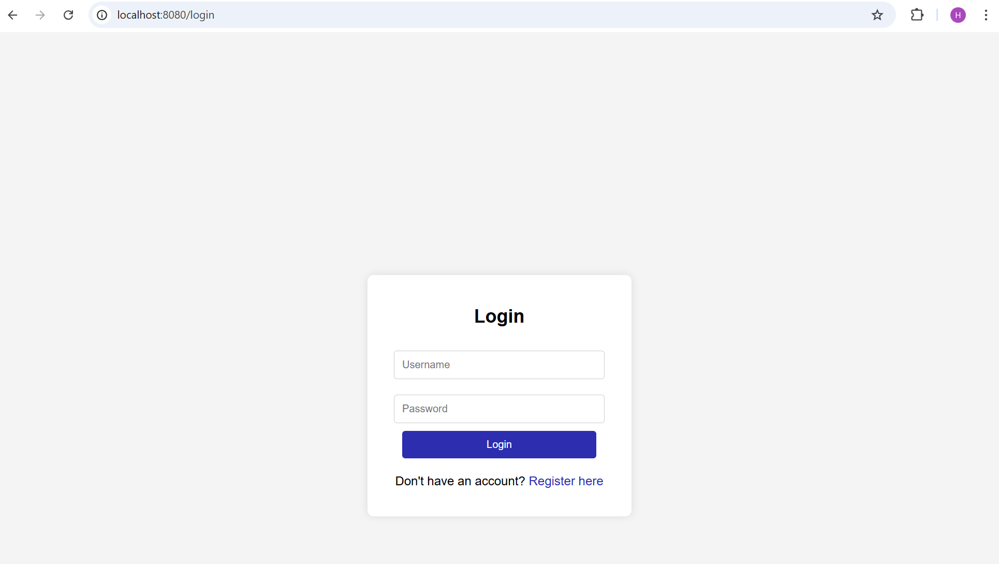
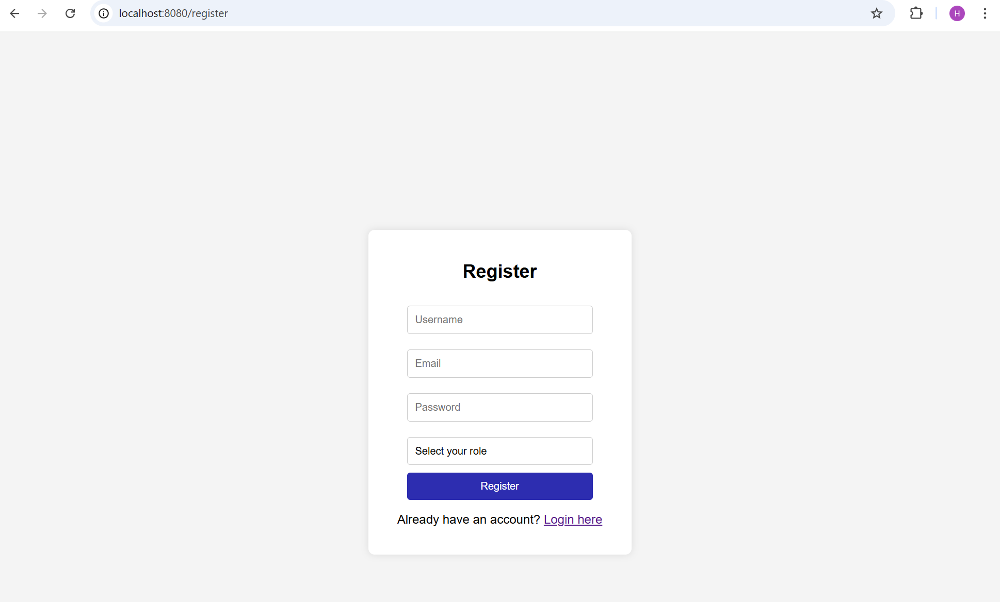
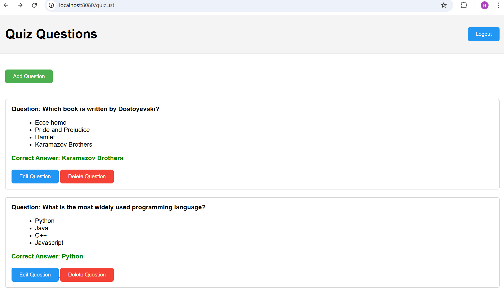
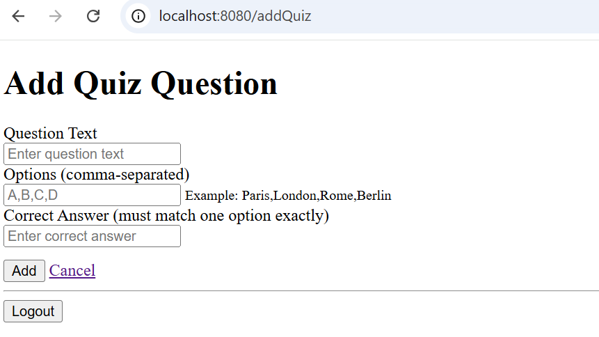
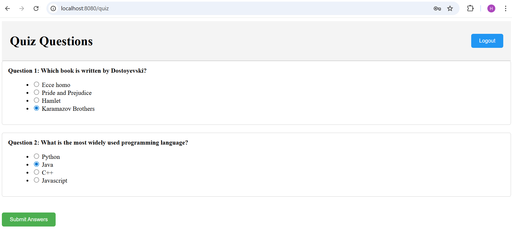
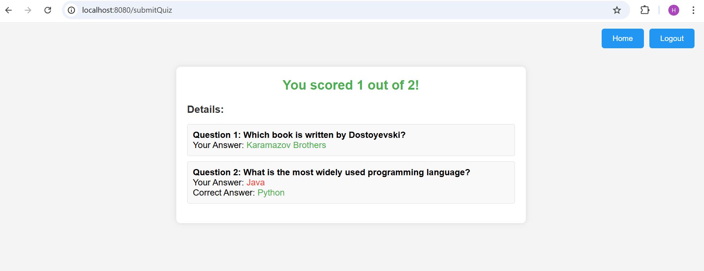

# Spring Boot Quiz Management System

A role-based quiz management web application built using **Spring Boot**, **Spring Security**, and **Thymeleaf**.

This project demonstrates secure authentication, role-based authorization, and full quiz management functionality using a clean layered MVC architecture.

---

## Features

### Authentication and Security
- User registration and login system
- Secure authentication using Spring Security
- Role-based authorization (ADMIN / USER)
- Protected routes and access control

### Quiz Management (Admin)
- Create new quiz questions
- Edit existing questions
- Delete quiz questions
- View all questions via admin panel

### Quiz Participation (User)
- Take quizzes through a web interface
- Submit answers
- Automatic quiz evaluation
- Result display with score calculation

---

## Technologies Used

### Backend
- Java
- Spring Boot
- Spring Security

### Frontend
- Thymeleaf
- HTML

### Build Tool
- Maven

### Architecture
- MVC (Model-View-Controller)
- Service Layer Pattern

---

## Architecture Overview

This project follows a layered architecture:


Controller → Handles HTTP requests and routing
Service → Contains business logic
Model → Defines application entities
Templates → Provides UI using Thymeleaf


This separation ensures maintainability, scalability, and clean code structure.

---

## Project Structure


src/main/java/com/example/quizapplication

config/
└── WebSecurityConfig.java

controller/
└── QuizController.java

model/
├── Question.java
└── User.java

service/
├── QuestionsService.java
└── QuizUserDetailsService.java

QuizApplication.java

src/main/resources/templates

├── login.html
├── register.html
├── quizList.html
├── quiz.html
├── addQuiz.html
├── editQuiz.html
└── result.html


---

## Screenshots

### Login Page


### Registration Page


### Admin Panel


### Add Question Page


### Quiz Page


### Result Page


---

## Role System

### ADMIN
- Create questions
- Edit questions
- Delete questions
- Access admin panel

### USER
- Take quizzes
- Submit answers
- View results

---

## Key Concepts Demonstrated

- Spring Boot web application development
- Spring Security authentication and authorization
- Role-based access control
- MVC architecture
- Service layer abstraction
- Secure form handling
- Server-side rendering with Thymeleaf

---

## How to Run

Clone the repository:

```bash
git clone https://github.com/KutayStudy/spring-boot-quiz-app.git

Navigate into the project:

cd spring-boot-quiz-app

Run the application:

mvn spring-boot:run

Open in browser:

http://localhost:8080/login
Author

Kutay Çalış
Computer Engineering Student

GitHub:
https://github.com/KutayStudy

License

MIT License
